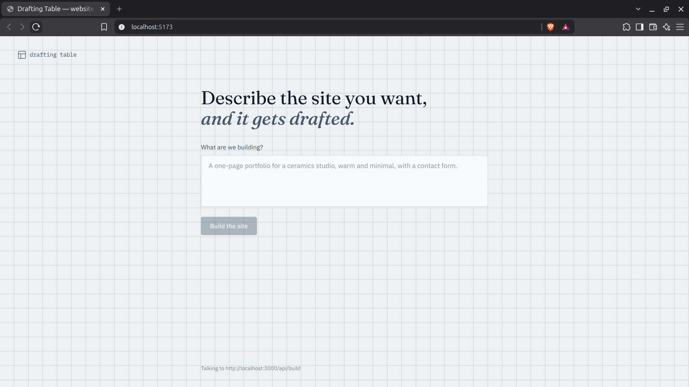
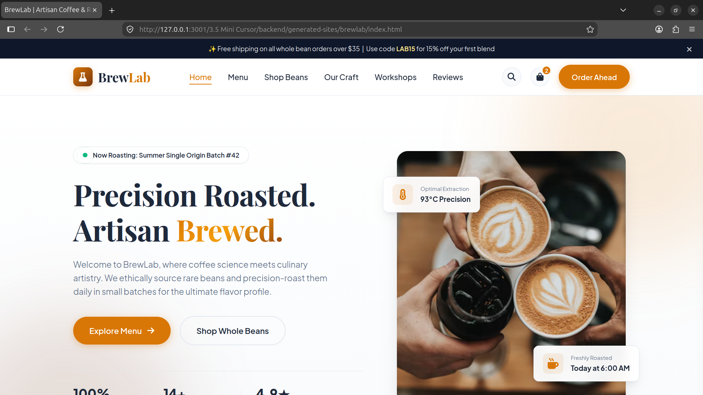

<div align="center">

# Drafting Table

### Describe it. Draft it. Run it.

An AI-powered website builder that turns natural-language prompts<br>
into complete static websites.

<br>


</div>

---

## About

Drafting Table is a local AI-powered website builder that converts a natural-language description into a working static website.

Instead of simply returning code in a chat, Gemini can interact with the project through filesystem tools and create the actual website files.

The generated website can then be opened directly in the browser through the Express server.

```text
Prompt → Gemini → Tool Calls → Website Files → Local Preview
```

---

## Features

* Generate websites from natural-language prompts
* AI tool calling for filesystem operations
* Automatically create `index.html`, `style.css`, and `script.js`
* Separate directory for each generated website
* Verify generated project files
* Safe filesystem path handling
* Local website preview
* Build status and activity log
* Responsive React frontend

---

## How It Works

Drafting Table uses Gemini as an AI agent rather than only as a text generator.

```text
User
 │
 │ Website prompt
 ▼
React Frontend
 │
 │ POST /api/build
 ▼
Express Backend
 │
 ▼
Gemini
 │
 │ Tool calls
 ▼
Filesystem Tools
 │
 ├── createDirectory
 ├── writeFile
 ├── readFile
 └── listFiles
 │
 ▼
generated-sites/
 │
 ▼
Express Static Server
 │
 ▼
Generated Website
```

The model decides which files need to be created and uses the available tools to build the project.

After generation, the project is verified before the preview URL is returned.

---

## Tech Stack

| Technology              | Purpose                    |
| ----------------------- | -------------------------- |
| React                   | Frontend                   |
| Tailwind CSS            | Styling                    |
| Vite                    | Frontend tooling           |
| Node.js                 | Backend runtime            |
| Express                 | REST API and local hosting |
| Google Gemini           | Website generation         |
| `@google/genai`         | Gemini SDK                 |
| HTML / CSS / JavaScript | Generated websites         |

---

## Project Structure

```text
drafting-table/
├── backend/
│   ├── src/
│   │   ├── ai.js
│   │   ├── server.js
│   │   ├── tools.js
│   │   └── toolDeclarations.js
│   │
│   └── generated-sites/
│
├── frontend/
│   └── src/
│       ├── App.jsx
│       ├── main.jsx
│       └── index.css
│
└── README.md
```

---

## Installation

### Clone the repository

```bash
git clone https://github.com/Purnendu-404/drafting-table.git
cd drafting-table
```

### Backend

```bash
cd backend
npm install
```

Create a `.env` file:

```env
GEMINI_API_KEY=your_api_key
```

Start the backend in development mode:

```bash
npm run dev
```

The backend runs on:

```text
http://localhost:3000
```

The `dev` script uses Nodemon and ignores changes inside `generated-sites/` so that generating website files does not continuously restart the server.

### Frontend

Open another terminal:

```bash
cd frontend
npm install
npm run dev
```

Open the URL provided by Vite.

---

## Usage

Enter a description of the website you want to build.

For example:

```text
Create a minimal portfolio website for a software developer.

Use a dark theme with a hero section, projects section,
skills section and contact form.
```

Drafting Table sends the prompt to Gemini, which creates the website files using the available tools.

Once the build is complete, the generated website can be opened locally.

---

## Screenshots

### Drafting Table



---

### Generated Website



---

## AI Tools

Drafting Table provides Gemini with a small set of filesystem tools:

| Tool              | Purpose                    |
| ----------------- | -------------------------- |
| `createDirectory` | Create a website directory |
| `writeFile`       | Create or update files     |
| `readFile`        | Read existing files        |
| `listFiles`       | Verify generated files     |

All generated projects are stored inside:

```text
generated-sites/
```

---

## Local Hosting

Generated websites are served by the same Express server used by the backend.

For example:

```text
generated-sites/
└── portfolio/
    ├── index.html
    ├── style.css
    └── script.js
```

can be opened at:

```text
http://localhost:3000/sites/portfolio/
```

This provides a local preview of the generated website rather than a public deployment.

---

## What I Learned

Building Drafting Table helped me understand how an AI application can go beyond generating text and actually interact with a project.

* Gemini function/tool calling
* Maintaining conversation history
* Connecting AI decisions to filesystem operations
* Building APIs with Express
* Connecting React with a Node.js backend
* Safe filesystem path handling
* Serving generated files through Express

---

## Future Improvements

* Edit generated websites through follow-up prompts
* Live preview inside the application
* Project history
* Download projects as ZIP files
* Git integration
* Public deployment

---

## Author

<div align="center">

### Purnendu Majumder

<a href="https://github.com/Purnendu-404">
  
</a>

</div>

---

<div align="center">

If you found this project interesting, consider giving it a star.

</div>
